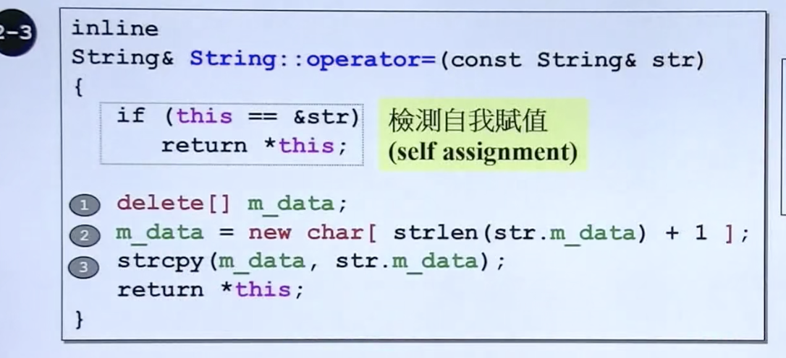
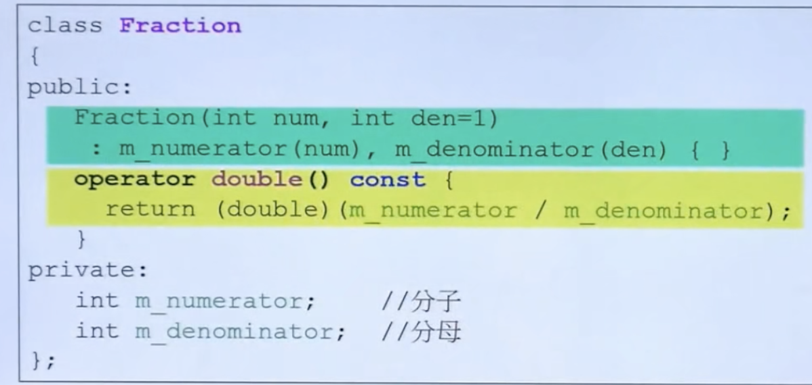

# STL体系结构与内核分析

## 基础知识 

指针大小：32位系统上为4B

## vector

* 扩容方式：2倍（所以可能会造成**==内存空间的浪费==**）
* 顺序存储
* 查找也是顺序查找

## list

双向链表！！！


## deque

队列，实际是分段连续

实际是重载运算符++  一个buffer满了 就会去找下一个buffer


## multimap/map

multimap可以键值重复，底层用的是红黑树

## unordered_map

底层用的是hash表

# C++基础

##   避免头文件循环引用

```C++
#ifndef _xxx_
#define _xxx_
...
#endif
```

> 建议任何一个头文件都加上上面的申明

## 友元

朋友可以随便拿自己的东西，比如private的类成员 friend可以随便访问

**==相同class的各个object互为friends(友元)==**


## 运算符重载

```C++
complex::operator += (this, const complex& r) {}
```

c2 += c1

在这里c2就是this c1就是显示的入参

==具体编译器this指针放置的位置不同，是隐藏的==

## 拷贝构造、拷贝赋值

class中如果带指针，就不能用编译器自带的要自己重写

 拷贝赋值，记得删除自己本身之前指向的内容，然后再创建需要创建的内容 




> 为何需要自我赋值检测？因为如果是本来就指向同一块地址，走到第1步，对应地址内容删除，第二步str会变成空指针！！！

## 转换函数



98709149970

## explicit 关键字

 如果申明了explicit，编译器不会自动调用该方法进行转换 

## 模板

### 类模板

需要指明类型

### 函数模板

不需要指明类型

 ### 成员模板

嵌套？