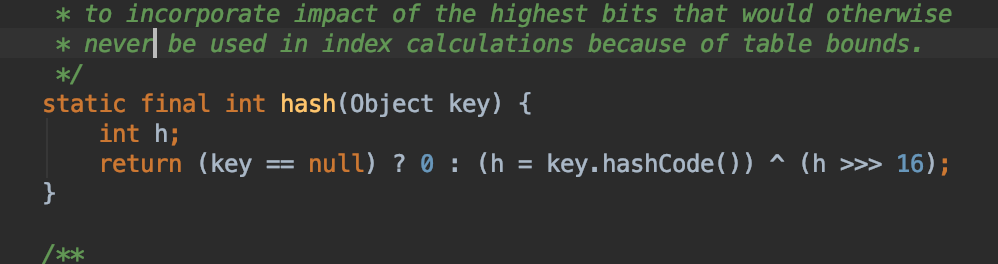
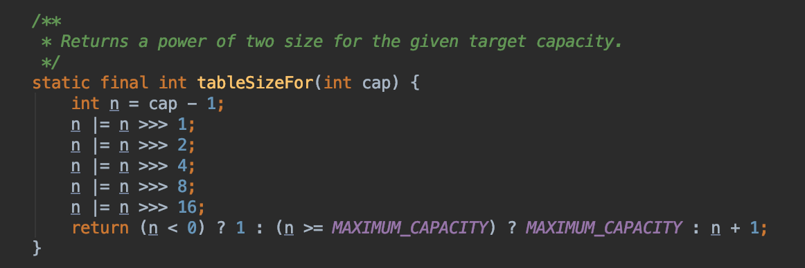

#  源码分析

主要是跟着B站的教学视频来看的，之前搜过类似的博客，说的都不是很清楚，结合B站视频，很多细节都了解了

## hash

源码中的hash方法

为啥要异或？因为异或操作可以让高位的信息也融合到低位当中，让其参与位运算，能够更好的让数据均匀分布

##  tableSizeFor

这个方法用来定义threshold

传入的参数是hashmap的容量，而且为啥容量要求是2的次幂？

因为cap-1就是 低位都是11111 能更好的和hash值与操作 让元素均匀分布