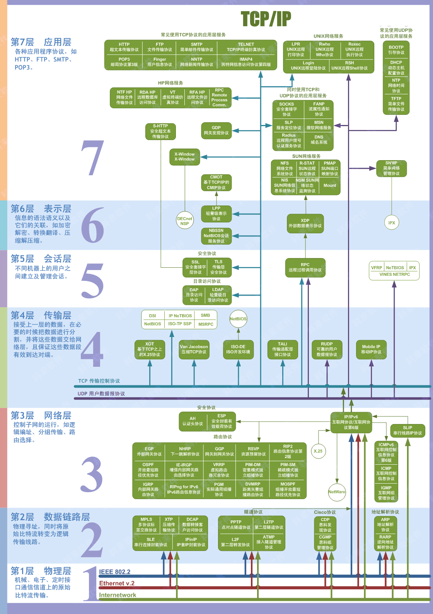

# 基础知识整理

## 字符与字节

字符：char  String数组 底层就是一个==char数组==  所以String的length就是char数组的长度，汉字有多少个长度就多少个

字节：byte

一个汉字可以用一个字符表示 比如Unicode编码

一个汉字如果要用字节表示的话得用==两个字节==


> Java语言中，中文字符所占的字节数取决于字符的编码方式，一般情况下，采用ISO8859-1编码方式时，一个中文字符与一个英文字符一样只占1个字节；采用GB2312或GBK编码方式时，一个中文字符占2个字节；而采用UTF-8编码方式时，一个中文字符会占3个字节。

在java中，char和byte都是基础数据类型，其中的byte和C++中的char类型是一样的，8位，1个字节，-128-127。但是，char类型，是16位，2个字节， '\u0000'-'\uFFFF'。

为什么java里的char是2个字节？ 

因为java内部都是用unicode的，所以java其实是支持中文变量名的，比如string 世界 = "我的世界";这样的语句是可以通过的。 

综上，java中采用GB2312或GBK编码方式时，一个中文字符占2个字节，而char是2个字节，所以是对的

## package

1. 为了更好地组织类，Java提供了包机制。包是类的容器，用于分隔类名空间。如果没有指定包名，所有的示例都属于一个默认的无名包。Java中的包一般均包含相关的类，java是跨平台的，所以java中的包和操作系统没有任何关系，java的包是用来组织文件的一种==虚拟文件系统==
2. import语句并没有将对应的java源文件拷贝到此处仅仅是引入，告诉编译器有使用外部文件，编译的时候要去读取这个外部文件。B错
3. Java提供的包机制与IDE没有关系
4. 定义在同一个包（package）内的类可以不经过import而直接相互使用。

## 接口和抽象类

```java
1、一个类可以有多个接口；
2、一个类只能继承一个父类；
3、接口中可以不声明任何方法，和成员变量
interface testinterface{
	
}
4、抽象类可以不包含抽象方法，但有抽象方法的类一定要声明为抽象类
 abstract class abstclass{
	abstract void meth();
}
```

## 类加载器ClassLoader

JDK中提供了三个ClassLoader，根据层级从高到低为：

```java
Bootstrap ClassLoader，主要加载JVM自身工作需要的类。 
Extension ClassLoader，主要加载%JAVA_HOME%\lib\ext目录下的库类。 
Application ClassLoader，主要加载Classpath指定的库类，一般情况下这是程序中的默认类加载器，也是**ClassLoader.getSystemClassLoader()** 的返回值。（这里的Classpath默认指的是环境变量中配置的Classpath，但是可以在执行Java命令的时候使用-cp 参数来修改当前程序使用的Classpath） 
```

JVM加载类的实现方式，我们称为 ==**双亲委托模型**==： 

如果一个类加载器收到了类加载的请求，他首先不会自己去尝试加载这个类，而是把这个请求委托给自己的父加载器，每一层的类加载器都是如此，因此所有的类加载请求最终都应该传送到顶层的**Bootstrap ClassLoader**中，只有当父加载器反馈自己无法完成加载请求时，子加载器才会尝试自己加载。 

**==双亲委托模型的重要用途是为了解决类载入过程中的安全性问题。==**

假设有一个开发者自己编写了一个名为***[Java](http://lib.csdn.net/base/java).lang.Object\***的类，想借此欺骗JVM。现在他要使用**自定义ClassLoader**来加载自己编写的***java.lang.Object\***类。然而幸运的是，**双亲委托模型**不会让他成功。因为JVM会优先在**Bootstrap ClassLoader**的路径下找到***java.lang.Object\***类，并载入它

## 类型转换


# 多线程

之前面试的时候华为面试官问过，但是我当时没怎么复习操作系统，而且也没有多线程的编程经验，当时没有答好。

现在随着工作中用到的多线程的知识越来越多，需要梳理一下

## 进程和线程的区别

1. 进程是==资源分配的基本单位==，==线程是调度和分派的基本单位==

## 多线程通信方式

### 锁

锁，用的最多的也就是synchronized关键字了，不多说

gitbook https://github.com/RedSpider1/concurrent 

阿里大神写的，做了参考

### 等待/通知机制

这也是一种通信方式，也就是Java里面的notify和wait

这里要注意，notify和wait要成对使用

然后注意下wait和sleep的区别:

* wait可以指定时间，也可以不指定；而sleep必须指定时间。
* wait释放cpu资源，同时释放锁；sleep释放cpu资源，但是不释放锁，所以易死锁。
* wait必须放在同步块或同步方法中，而sleep可以再任意位

## join方法

A线程调用B线程的join 方法，则A线程需要等待B线程结束之后才能被唤醒

## 线程池

### 优先级

==提交优先级：核心线程>工作队列>非核心线程==

==执行优先级：核心线程>非核心线程>工作队列==

# 设计模式

## 单例模式

### 何时用单例？

到现在还是很迷糊，到底啥时候用单例模式啊 ，现在只知道是数据库的连接用单例，然后Android里面见到广播接收器manager是单例，还是不太清楚为何用单例。

### 双重校验

为了减少锁的开销，只对创建对象的时候进行加锁

```java
public class Singleton {
    private volatile static Singleton singleton;
    private Singleton (){}
    public static Singleton getSingleton() {
        if (singleton == null) {
            synchronized (Singleton.class) {
                if (singleton == null) {
                    singleton = new Singleton();
                }
            }
        }
        return singleton;
    }
}
```

> 需要两次判空的原因：第一次判断是否需要创建对象，第二次是为了防止，两个线程同时满足第一个判空条件进入同步代码区的时候，先拿到锁的会去创建对象，对于后面拿到锁的需要再次判断是否对象已经创建好了。


##  策略模式

说白了就是抽象处理方法，对于不同场景使用不同的算法进行处理

## 观察者模式

Subject 包含Observe，需要的时候去通知他们。

### 观察者模式的改进

正常的观察者模式里面Subject里面还是依赖Observe对象，需要Observe对象实现具体的接口。

万一重构的代码是已经实现好的类，这时候观察者模式就不太好用了。

这个时候就可以用到**委托模式**

>  实际上就是委托第三方去添加删除Observe，同时在需要通知的时候去执行所有Observe的特定的方法

```java
//数学老师
Teacher math = new Teacher();
//打游戏的小明同学
GameObserver a = new GameObserver("小明",math);
//看NBA地小杨同学
NBAObserver b = new NBAObserver("小杨", math);
//将二者方法委托到老师的更新上
math.Update += new EventHandler(a.CloseGame);
math.Update += new EventHandler(b.CloseNBA);
//老师回来了
math.SubjectState = "数学老师来教室了！";
//触发通知
math.Notify();
```


> 在Java中就是使用反射，EventHandler传入函数名，通过反射来根据函数名来执行对应的方法

# 计算机网络

## 网络模型




### 各层次详解

#### 1、物理层

（1）概念：是[计算机网络](http://baike.baidu.com/view/25482.htm)[OSI模型](http://baike.baidu.com/view/571842.htm)中最低的一层。物理层规定:为传输数据所需要的物理链路创建、维持、拆除，而提供具有机械的，电子的，功能的和规范的特性。简单的说，物理层确保原始的[数据](http://baike.baidu.com/view/38752.htm)可在各种物理媒体上传输。[局域网](http://baike.baidu.com/view/788.htm)与[广域网](http://baike.baidu.com/view/21956.htm)皆属第1、2层。

（2）协议物理层支持的协议有：OSI采纳了各种现成的协议，其中有RS-232、RS-449、X.21、V.35、ISDN、以及FDDI、IEEE802.3、IEEE802.4、和IEEE802.5等802系列部分无线网协议等协议。

（3）设备：双绞线（3,5，超5,6,7类线），同轴电缆，光纤，无线传输（电磁，无线电，微波，红外线，激光灯）、**==集线器、中继器==**

（4）数据单元：**==比特（bit）==**

（5）总结：简单来说，物理层规定了数据如何在线路上传输，不仅仅是线路的创建，传输材质的选择，还包含了确保传输稳定的协议。从信息封装和隐藏的角度去思考，物理层能够确保信息传输与设备无关，只要协议正确，你用什么样的传输线路都是可以的。

（6）其他在连接设备的时候，我们经常看到我们的链接线上表示着DTE和DCE两个标志，那么分别是什么含义呢？

DTE（Data Terminal Equipment），是数据终端设备，具有一定的数据处理能力和发送、接受数据能力的设备。

DCE（Data Circuit-terminating Equipment），是数据电路端设备，他在DTE和传输线路之间提供信号变换和编码的功能，并且负责建立、保持和释放数据链路的链接。

一般而言，现在的连接线DTE和DCE接口是一样的，而且设备（路由器）也允许互插，只不过标记DCE的头部链接的设备要设置一些同步时间的东东，这样两个设备才能同步工作。

#### 2、链路层

（1）概念：[数据链路层](http://baike.baidu.com/view/239592.htm)的最基本的功能是向该层[用户](http://baike.baidu.com/view/200012.htm)提供透明的和可靠的[数据传送](http://baike.baidu.com/view/5593592.htm)基本服务。透明性是指该层上传输的数据的内容、格式及编码没有限制，也没有必要解释信息结构的意义；可靠的 传输使用户免去对丢失信息、干扰信息及顺序不正确等的担心。在[物理层](http://baike.baidu.com/view/239585.htm)中这些情况都可能发生，在数据链路层中必须用[纠错码](http://baike.baidu.com/view/126214.htm)来检错与纠错。数据链路层是对物理层传输原始[比特](http://baike.baidu.com/view/189728.htm)流的功能的加强，将物理层提供的可能出错的[物理连接](http://baike.baidu.com/subview/5317561/5348699.htm)改造成为逻辑上无差错的[数据链路](http://baike.baidu.com/view/1128788.htm)，使之对网络层表现为一无差错的线路。

（2）协议：链路层支持的协议有：PPP，HDLC，ATM，VLAN，ARQ（自动重传请求协议），CSMA/CD（载波监听多点介入/碰撞检测协议），LCP（链路控制协议，是网络控制协议），ATM（异步传递方式），无线网的802系列协议的一部分

（3）设备：==交换机、网桥、网卡==等

（4）数据单元：==帧（frame）==

（5）总结：链路层的主要作用--透明传输、差错校验、流量控制、链路管理、MAC寻址、帧同步。

（6）其他：链路层一般包含两个子层：LLC和MAC层。这两个子层的作用稍后细讲。

#### 3、网络层

（1）概念：网络层是[OSI参考模型](http://baike.baidu.com/view/38361.htm)中的第三层，介于[传输层](http://baike.baidu.com/view/239605.htm)和[数据链路层](http://baike.baidu.com/view/239592.htm)之间，它在数据链路层提供的两个相邻端点之间的数据帧的传送功能上，进一步管理网络中的[数据通信](http://baike.baidu.com/view/49233.htm)，将数据设法从源端经过若干个中间[节点](http://baike.baidu.com/view/47398.htm)传送到[目的](http://baike.baidu.com/view/652289.htm)端，从而向运输层提供最基本的端到端的[数据传送](http://baike.baidu.com/view/5593592.htm)服务。主要内容有：虚电路分组交换和[数据报](http://baike.baidu.com/view/121589.htm)分组交换、[路由选择](http://baike.baidu.com/view/632880.htm)[算法](http://baike.baidu.com/view/7420.htm)、阻塞控制方法、[X.25协议](http://baike.baidu.com/view/175414.htm)、综合业务数据网（ISDN）、[异步传输模式](http://baike.baidu.com/view/27150.htm)（ATM）及网际互连[原理](http://baike.baidu.com/view/437790.htm)与实现。

（2）协议：==IP协议，ARP（地址解析协议）==、RARP（逆地址解析协议），SNMP（简单网络管理协议），，DHCP（动态主机配置协议），ICMP（Internet 控制报文协议），IGMP（Internet 组管理协议），RIP（路由信息协议），OSPF（开放式最短路径优先协议），BGP4（边界网关协议），IS-IS（中间系统到中间系统的路由选择协议），IPsec（Internet 协议安全性）

（3）设备：路由器、防火墙，多层交换机（也叫三层交换机，带网络层的交换机）

（4）数据单元：==数据包（packet）==

（5）总结：网络层和传输层是计算机网络的重点和难点。网络层相关的知识有很多，除了基础IP协议，还包括ARP协议，RARP协议，以及常见的路由协议都需要掌握。

#### 4、传输层

（1）概念：传输层（Transport Layer）是ISO OSI协议的第四层协议，实现端到端的数据传输。该层是两台[计算机](http://baike.baidu.com/view/3314.htm)经过网络进行[数据通信](http://baike.baidu.com/view/49233.htm)时，第一个端到端的层次，具有缓冲作用。当[网络层](http://baike.baidu.com/view/239600.htm)服务质量不能满足要求时，它将服务加以提高，以满足[高层](http://baike.baidu.com/view/1281420.htm)的要求；当网络层服务质量较好时，它只用很少的工作。传输层还可进行复用，即在一个网络连接上创建多个逻辑连接。

传输层在终端用户之间提供透明的数据传输，向上层提供可靠的数据传输服务。传输层在给定的链路上通过流量控、分段/重组和差错控制。一些协议是面向链接的。这就意味着传输层能保持对分段的跟踪，并且重传那些失败的分段。

（2）协议：==TCP（传输控制协议），UDP（数据报拥塞控制协议）==，SCTP（流控制传输协议），RTP（实时传送协议），RSVP（资源预留协议），PPTP（点对点隧道协议）

（3）设备：

（4）数据单元：**==数据段（Segment）==**

（5）总结：传输层的重点是TCP协议和UDP协议的掌握，PPTP最常用的实在VPN中，这个也可以适当了解。

#### 5、应用层（会话层、表示层、应用层三层总称）

数据单元：==报文（Message）==

协议：

NTP  （Network Time Protocol ）网络校时协议。 

GTP 通用数据传输平台

DHCP(Dynamic Host Configuration Protocol)动态主机分配协议，使用 UDP 协议工作，主要有两个用途：给内部网络或网络服务供应商自动分配 IP 地址，给用户或者内部网络管理员作为对所有计算机作中央管理的手段。实 现即插即用连网。 


BOOTP (BOOTstrapProtocol) 引导程序协议/ 自举协议，使用UDP 来使 一个无盘工作站自动获取配置信息。静态的配置协议 DNS   （Domain Name System ）域名解析<端口号53> 


FTP  （File Transfer Protocol ）文件传输协议<端口号21>减少或消除不同操作系统下处理文件的不兼容性。 

Gopher  （The Internet Gopher Protocol ）网际Gopher 协议 

HTTP   （Hypertext Transfer Protocol ）超文本传输协议 <端口号 80>， 面向事务的应用层协议。 

IMAP4 (Internet Message Access Protocol 4) Internet 信息访问协议的第 4 版本 

IRC  （Internet Relay Chat ）网络聊天协议 

NNTP   （Network News Transport Protocol ）网络新闻传输协议 

XMPP 可扩展消息处理现场协议 

POP3 (Post Office Protocol 3) 即邮局协议的第3 个版本，用于接受邮件。 

SIP()信令控制协议 

SMTP （Simple Mail Transfer Protocol ）简单邮件传输协议 <端口号25> 用于发送邮件。 


SNMP (Simple Network Management Protocol),简单网络管理协议 

SSH  （Secure Shell ）安全外壳协议 

TELNET   远程登录协议 <端口号23> 

RPC  （Remote Procedure Call Protocol ）（RFC- 1831）远程过程调用协 议 

RTCP   （RTP Control Protocol ）RTP  控制协议 

RTSP  （Real Time Streaming Protocol ）实时流传输协议 

TLS  （Transport Layer Security Protocol ）安全传输层协议 

SDP( Session Description Protocol ）会话描述协议 


SOAP  （Simple Object Access Protocol ）简单对象访问协议 

STUN  （Simple Traversal of UDP over NATs ，NAT    的UDP 简单穿越） 是一种网络协议 

## 网络地址

网络地址是IP地址与子网掩码==按位与==的结果，单凭IP地址不能看出网络地址

## 基本概念

### MTU和MSS的区别

最大报文段长度（MSS）与[最大传输单元](https://baike.baidu.com/item/最大传输单元/9730690)（Maximum Transmission Unit, MTU）均是协议用来定义最大长度的。不同的是，MTU应用于OSI模型的第二层数据链接层，并无具体针对的协议。MTU限制了数据链接层上可以传输的数据包的大小，也因此限制了上层（网络层）的数据包大小。例如，如果已知某局域网的MTU为1500字节，则在网络层的[因特网协议](https://baike.baidu.com/item/因特网协议/9453796)（Internet Protocol, IP）里，最大的数据包大小为1500字节（包含IP协议头）。MSS针对的是OSI模型里第四层传输层的TCP协议。因为MSS应用的协议在数据链接层的上层，MSS会受到MTU的限制

# Spring

## 常用依赖

```xml
<!-- https://mvnrepository.com/artifact/org.springframework/spring-webmvc -->
<dependency>
    <groupId>org.springframework</groupId>
    <artifactId>spring-webmvc</artifactId>
    <version>5.3.4</version>
</dependency>
<!-- https://mvnrepository.com/artifact/junit/junit -->
<dependency>
    <groupId>junit</groupId>
    <artifactId>junit</artifactId>
    <version>4.12</version>
    <scope>test</scope>
</dependency>

```

## 开启Spring注解

```xml
<?xml version="1.0" encoding="UTF-8"?>
<beans xmlns="http://www.springframework.org/schema/beans"
    xmlns:xsi="http://www.w3.org/2001/XMLSchema-instance"
    xmlns:context="http://www.springframework.org/schema/context"
    xsi:schemaLocation="http://www.springframework.org/schema/beans
        https://www.springframework.org/schema/beans/spring-beans.xsd
        http://www.springframework.org/schema/context
        https://www.springframework.org/schema/context/spring-context.xsd">

    <context:annotation-config/>

</beans>
```


## 控制反转

之前，程序是主动创建对象，控制权在程序员手中

使用set接口可以让使用者自己传入自己的需求，控制权在用户手中，我们被动接受，实现控制权的转移

## @Autowired

用于属性的自动装配，也可用在setXXX方法上，构造方法上。

使用Autowired我们可以不用编写Set方法，前提是这个自动装配的属性在IOC容器中存在，切符合byName

## @Resource

java的原生注解，也适用于装配，只不过优先使用名字，在通过类型

## @Component

放在类上，意味着该类被装配了，由Spring管理

它有几个衍生注解

- dao @Repository
- service @Service
- controller @Controller

这些都是按照MVC架构来的，这些名字同Component一样，都是组件的意思,功能也是一样，都是将某个类注册到Spring容器中进行装配。


## 整合mybatis

### 导包

```xml
				<dependency>
            <groupId>junit</groupId>
            <artifactId>junit</artifactId>
            <version>4.12</version>
        </dependency>
        <dependency>
            <groupId>mysql</groupId>
            <artifactId>mysql-connector-java</artifactId>
            <version>5.1.46</version>
        </dependency>
        <!-- https://mvnrepository.com/artifact/org.mybatis/mybatis -->
        <dependency>
            <groupId>org.mybatis</groupId>
            <artifactId>mybatis</artifactId>
            <version>3.5.3</version>
        </dependency>
        <!-- https://mvnrepository.com/artifact/org.springframework/spring-webmvc -->
        <dependency>
            <groupId>org.springframework</groupId>
            <artifactId>spring-webmvc</artifactId>
            <version>5.3.4</version>
        </dependency>
        <!--如果Spring要操作数据库的话，还需要一个Spring-jdbc-->
        <dependency>
            <groupId>org.springframework</groupId>
            <artifactId>spring-jdbc</artifactId>
            <version>5.2.13.RELEASE</version>
        </dependency>
        <!--aop需要的包-->
        <dependency>
            <groupId>org.aspectj</groupId>
            <artifactId>aspectjweaver</artifactId>
            <version>1.9.6</version>
        </dependency>
        <!-- https://mvnrepository.com/artifact/org.mybatis/mybatis-spring -->
        <!--整合mybatis和Spring的jar包-->
        <dependency>
            <groupId>org.mybatis</groupId>
            <artifactId>mybatis-spring</artifactId>
            <version>2.0.6</version>
        </dependency>
```

### 步骤

1. 编写实体类

2. 编写核心配置文件
3. 编写接口
4. 编写Mapper.xml
5. 测试

### mybatis-spring

将mybatis和Spring整合，由Spring托管

#### 步骤

1. 编写数据源配置
2. sqlSessionFactory
3. sqlSessionTemplate
4. 需要给接口加实现类
5. 将自己写的实现类，注入到Spring中使用

### 事务


# springMVC

## 依赖

```xml
<dependencies>
        <dependency>
            <groupId>junit</groupId>
            <artifactId>junit</artifactId>
            <version>4.12</version>
        </dependency>
        <dependency>
            <groupId>org.springframework</groupId>
            <artifactId>spring-webmvc</artifactId>
            <version>5.3.4</version>
        </dependency>
        <dependency>
            <groupId>javax.servlet</groupId>
            <artifactId>servlet-api</artifactId>
            <version>2.5</version>
        </dependency>
        <dependency>
            <groupId>javax.servlet.jsp</groupId>
            <artifactId>jsp-api</artifactId>
            <version>2.2</version>
        </dependency>
        <dependency>
            <groupId>javax.servlet</groupId>
            <artifactId>jstl</artifactId>
            <version>1.2</version>
        </dependency>
    </dependencies>
```


## servlet示例


创建正常的module，随后使用add Framework support 变成web项目

### web.xml

```xml
<?xml version="1.0" encoding="UTF-8"?>
<web-app xmlns="http://xmlns.jcp.org/xml/ns/javaee"
         xmlns:xsi="http://www.w3.org/2001/XMLSchema-instance"
         xsi:schemaLocation="http://xmlns.jcp.org/xml/ns/javaee http://xmlns.jcp.org/xml/ns/javaee/web-app_4_0.xsd"
         version="4.0">
    <servlet>
        <servlet-name>hello</servlet-name>
        <servlet-class>HelloServlet</servlet-class>
    </servlet>
    <servlet-mapping>
        <servlet-name>hello</servlet-name>
        <url-pattern>/hello</url-pattern>
    </servlet-mapping>
</web-app>
```

### HelloServlet.java

```java
import javax.servlet.ServletException;
import javax.servlet.http.HttpServlet;
import javax.servlet.http.HttpServletRequest;
import javax.servlet.http.HttpServletResponse;
import java.io.IOException;

public class HelloServlet extends HttpServlet {
    @Override
    protected void doGet(HttpServletRequest req, HttpServletResponse resp) throws ServletException, IOException {
        String method = req.getParameter("method");
        if(method.equals("add")) {
            req.getSession().setAttribute("msg","执行了add方法22222");
        }
        if(method.equals("delete")) {
            req.getSession().setAttribute("msg","执行了delete方法");
        }
        req.getRequestDispatcher("/WEB-INF/jsp/test.jsp").forward(req,resp);
    }

    @Override
    protected void doPost(HttpServletRequest req, HttpServletResponse resp) throws ServletException, IOException {
        doGet(req,resp);
    }
}

```

## MVC 示例

### web.xml

```xml
<?xml version="1.0" encoding="UTF-8"?>
<web-app xmlns="http://xmlns.jcp.org/xml/ns/javaee"
         xmlns:xsi="http://www.w3.org/2001/XMLSchema-instance"
         xsi:schemaLocation="http://xmlns.jcp.org/xml/ns/javaee http://xmlns.jcp.org/xml/ns/javaee/web-app_4_0.xsd"
         version="4.0">

    <servlet>
        <servlet-name>springmvc</servlet-name>
        <servlet-class>org.springframework.web.servlet.DispatcherServlet</servlet-class>
    <!--关联一个springMVC的配置文件-->
        <init-param>
            <param-name>contextConfigLocation</param-name>
            <param-value>classpath:springmvc-servlet.xml</param-value>
        </init-param>
        <!--启动数字越小，启动越早-->
        <load-on-startup>1</load-on-startup>
    </servlet>
    <!--所有请求都会被SpringMVC拦截-->
    <servlet-mapping>
        <servlet-name>springmvc</servlet-name>
        <url-pattern>/</url-pattern>
    </servlet-mapping>
</web-app>
```

### springmvc配置文件

```xml
<?xml version="1.0" encoding="UTF-8"?>
<beans xmlns="http://www.springframework.org/schema/beans"
       xmlns:xsi="http://www.w3.org/2001/XMLSchema-instance"
       xmlns:context="http://www.springframework.org/schema/context"
       xmlns:mvc="http://www.springframework.org/schema/mvc"
       xsi:schemaLocation="http://www.springframework.org/schema/beans
        https://www.springframework.org/schema/beans/spring-beans.xsd
        http://www.springframework.org/schema/context
        https://www.springframework.org/schema/context/spring-context.xsd
        http://www.springframework.org/schema/mvc
        https://www.springframework.org/schema/mvc/spring-mvc.xsd">

    <context:component-scan base-package="com.zhb.controller"/>
    <!--让SpringMVC不处理静态资源， .css .mp4 .js......-->
    <mvc:default-servlet-handler/>
    <!--支持MVC注解驱动，会自动注入处理器映射器和适配器-->
    <mvc:annotation-driven/>

    <!--视图解析器-->
    <bean class="org.springframework.web.servlet.view.InternalResourceViewResolver" id="InternalResourceViewResolver">
        <property name="prefix" value="/WEB-INF/jsp/"/>
        <property name="suffix" value=".jsp"/>
    </bean>
</beans>
```

### Controller

```java
package com.zhb.controller;

import org.springframework.stereotype.Controller;
import org.springframework.ui.Model;
import org.springframework.web.bind.annotation.RequestMapping;

@Controller
public class HelloController {
    @RequestMapping("/hello")
    public String hello(Model model){
        //封装数据
        model.addAttribute("msg","Hello SpringMVC!!!!!!!!");
        return "hello";
    }
}
```


