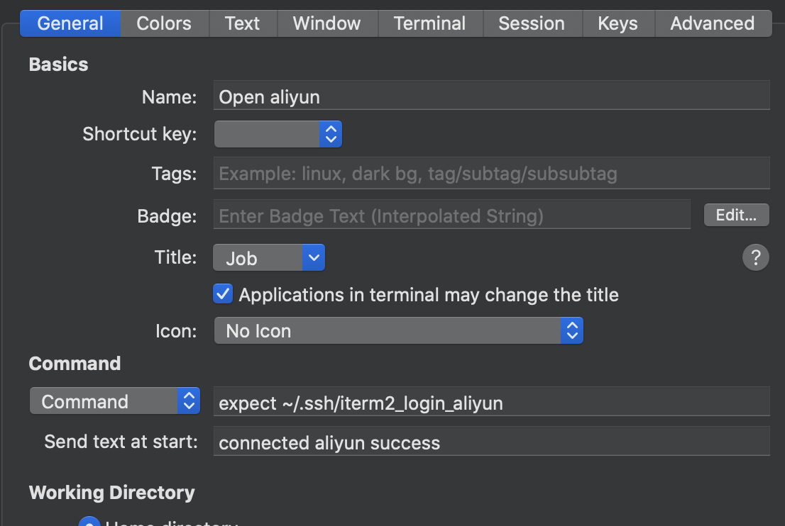
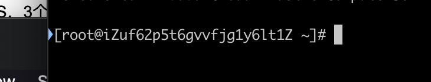
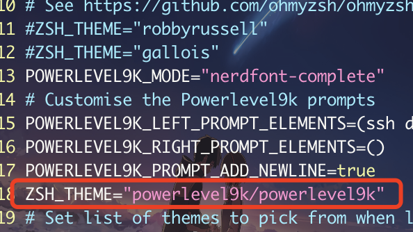

# shell操作 

***

## ssh 连接阿里云

> SSH 为 [Secure Shell](https://baike.baidu.com/item/Secure Shell) 的缩写，由 IETF 的网络小组（Network Working Group）所制定；SSH 为建立在应用层基础上的安全协议。SSH 是较可靠，专为[远程登录](https://baike.baidu.com/item/远程登录/1071998)会话和其他网络服务提供安全性的协议。

普通操作：

```shell
ssh -p 端口 用户名@ip地址
```

编写脚本使用ITrem2 通过ssh自动连接阿里云：

```shell
set user 用户名
set host 101.132.36.138（远程主机IP地址）
set port 22
set password 密码
spawn ssh $user@$host
expect "password:"
send "$password\r"
interact
expect eof
```

编写号脚本之后增加profile方便后面直接连接



##  Iterm2 传输文件到远程服务器

首先点击Iterm2 下面的这个安装插件


安装完之后对应的远程服务器就有一个三角图标了



之后只要 拖动本地文件到远程服务器窗口（==同时按住option键==）即可


## 常用快捷键

跳转到文件头部 gg

跳转到文件尾部 G

跳转到当前行尾部  $  继续按a可以在行尾后面编辑

跳转到当前行头部 0  0w就是当前行第一个字符处

截图 shift+command+4


# 配置Iterm2

看着网上大神们的终端非常炫酷，也想自己配置下，主要参考下面的连接

> https://blog.biezhi.me/2018/11/build-a-beautiful-mac-terminal-environment.html

写的算比较详细了，主要记录下踩的坑

## github下载仓慢

这个问题捣鼓了很久，先是用代理，还是不行经常断，导致下载失败。

后面采用了下面这个方法，很管用，就是复制git仓的链接到==gitee码云==，基本上码云都有对应的别人下号的仓，直接替换要下的仓的链接就好了，非常快

比如下载字体

`git clone https://github.com/bhilburn/powerlevel9k.git ~/.oh-my-zsh/custom/themes/powerlevel9k`

把 git clone 后面的链接替换成码云上的链接即可


## 配置Powerlevel9k 图标没显示

一直按照网上的步骤来的，但是没有生效，后面发现，对于Powerlevel9k配置项的配置必须在设置主题之前



